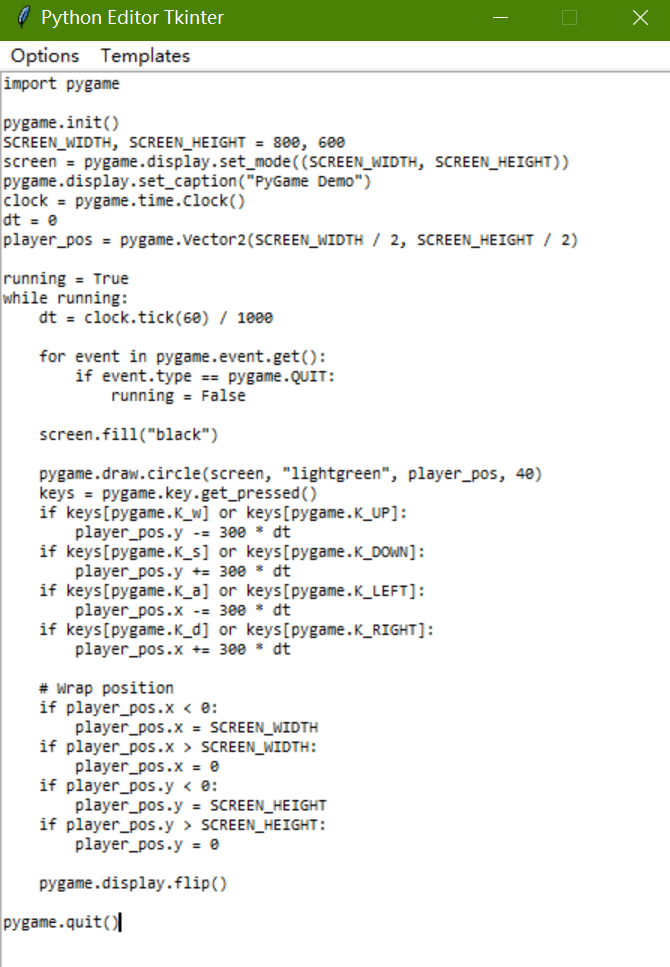

# Python Code Editor Using `tkinter` Library



## Description
This is a simple Python code editor built with the `tkinter` library. It comes with:

- A plain text editor for writing Python code (no syntax highlighting yet)
- A straightforward menu bar with basic features like saving and opening files
- 3 handy Python code templates for PyGame, Tkinter, and Matplotlib projects

## Prerequisites
You'll need Python 3.11+ and two extra libraries: `pygame` and `matplotlib`. 

Good news: `tkinter` is already included in Python 3.11+, so no need to install that separately!

Once you have Python 3.11+ set up, install the required libraries with these commands:
```bash
pip install pygame
pip install matplotlib
```

## Installation and Usage

1. Clone this repository to your computer:
```bash
git clone https://github.com/Pac-Dessert1436/python-editor-tkinter.git
```
2. Move into the project folder:
```bash
cd python-editor-tkinter
```
3. Start the editor:
```bash
python editor.py
```
4. Start writing your Python code! You'll find basic options like opening/saving files in the "Options" menu.
5. To see your code in action, just click "Run Code" - you'll find that in the "Options" menu too!
6. Looking forward to a template? Check out the "Templates" menu for ready-to-use starters for PyGame, Tkinter, and Matplotlib.

## WARNING: Don't open multiple GUI windows while running code!
If you try to open another GUI window before closing the current one, the editor might crash with this error:
```
Fatal Python error: PyEval_RestoreThread: the function must be called with the GIL held, after Python initialization and before Python finalization, but the GIL is released (the current Python thread state is NULL)
```
So just close the first window before opening a new one!

## Personal Note
I'm a graduate from the College of Agriculture and Biology, at Zhongkai University of Agriculture and Engineering. Before graduating, I was really into bioinformatics, but these days I'm not sure if I'll stick with that path.

Right now, I'm studying at home for the Postgraduate Entrance Exam - there are only 120 days left, but it's been tough to stay focused. I keep getting distracted, and that's how this project came about. Building a little tool where I can "write Python in Python" felt like a nice way to relax when I couldn't concentrate on my study materials.

It took me until mid-August to finally decide to focus on Chinese Materia Medica for the exam, after going back and forth for several months. But even now, my motivation for studying comes and goes, and I keep finding myself drawn back to programming. I can't help but wonder why I struggle so much with exam preparation, feeling guilty for letting people down when I'd rather be coding.

I actually promised myself I'd take a break from GitHub after finishing my [Calendar app](https://github.com/Pac-Dessert1436/Calendar-App-MakeCode-PyGame) at the end of July. I need to keep that promise and refocus on the exam - this project is just a small detour, after all. Wish me luck!

## License
This project is licensed under the MIT License - check out the [LICENSE](LICENSE) file for details.